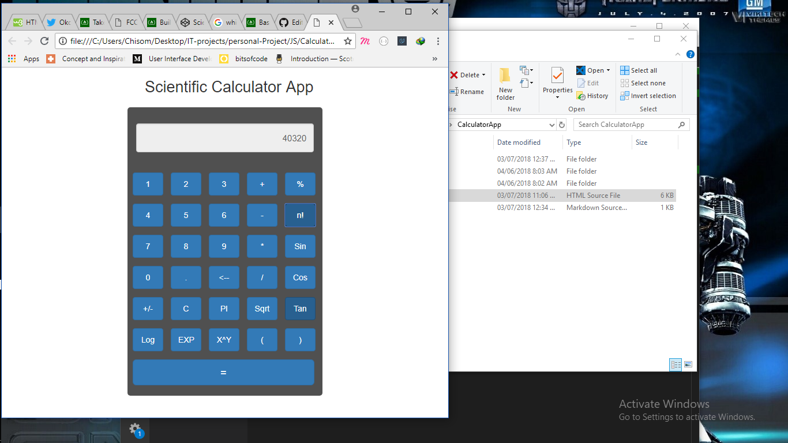

# CalculatorApp 

this is a calculator application on javascript,
which the javascript functions are in an external file name 
"calculator.js" in the js folder.

## Features of this Application

* It is responsive
* It is a scientific Calculator with most function feature in it

This is the screenshot of the application.

